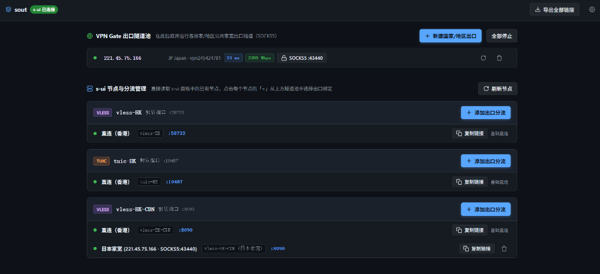

# sout - s-ui 动态家宽出口与单端口多用户分流插件

<p align="center">
  <b>基于 VPN Gate 的全球动态公共家宽出口池 · s-ui (sing-box) 深度适配插件</b>
</p>

---
## 一键安装

在 Linux 服务器（Ubuntu / Debian / CentOS / Alpine 等）上执行：

```bash
bash <(curl -fsSL https://raw.githubusercontent.com/ustdbus/sout/main/install.sh)
```

---

## 核心特性

- 🎯 **s-ui 原生深度适配**：专为 `s-ui` 面板（sing-box 内核）打造，直接对接 SQLite 数据库与路由引擎，配置秒级热重载。
- ⚡ **单端口多用户智能分流（0 额外端口占用）**：
  - 彻底废除多端口克隆机制，所有家宽分流与原生直连节点 100% 共享母机入站端口（如 REALITY、VMess-WS 等）。
  - 分流节点与母节点完全共用网络传输参数
- 🛠️ **极简终端运维命令**：
  - 在终端输入 `sout` 即可呼出交互式控制台，支持管理端口与监听地址、口令、路径重置、Cloudflare 隧道配置、检查更新及一键干净卸载。

---

## 面板界面与使用指南

<p align="center">
  
</p>

### 1. 顶部状态与全量订阅导出
* **`s-ui 已连接`**：当系统自动检测并成功对接本地 s-ui 面板后，顶部会显示绿色连接徽章。
* **`导出全部链接`**：点击可一键直达 `/sub` 专属订阅接口。支持 Base64 / 纯文本自适应导出**全部母机直连节点与已添加的家宽分流节点**，可直接导入各类代理客户端。
* **`⚙ 设置`**：支持动态修改访问口令、访问路径、管理端口、监听地址（支持一键绑定 `127.0.0.1`）以及反向代理自定义面板 URL。

---

### 2. 模块一：VPN Gate 出口隧道池
* **功能说明**：在此模块拉取并管理用于出站的全球公共家宽出口。
* **新建出口**：点击 **`+ 新建国家/地区出口`**，选择目标国家/地区（如日本、香港、美国、韩国、新加坡等或不限地区），系统会自动筛选高带宽、低延迟的优质家宽节点并在后台建立独立的 OpenVPN 隧道与本地 SOCKS5 转发。
* **实时监控与管理**：每个出口均实时显示公网出口 IP、延迟（ms）、带宽（Mbps）及 SOCKS5 转发端口；支持一键测速刷新或删除。

---

### 3. 模块二：s-ui 节点与分流管理（核心特色）
* **自动同步入站**：面板会自动读取 s-ui 中现有的所有直连入站（如 VLESS-HK、TUIC-HK、VMess-WS-CDN 等）。
* **一键添加家宽分流（单端口多用户）**：
  1. 在任一母节点右侧点击 **`+ 添加出口分流`**；
  2. 选择上方已就绪的家宽出口（如 `日本家宽`）；
  3. 系统会自动在 s-ui 该入站下派生一个分流用户，并自动向 sing-box 下发 `auth_user` 路由规则，**无需占用任何新的端口，完全共用母节点的端口与所有网络传输配置**。
* **一键复制与使用**：
  * 点击直连节点的 **`复制链接`**，即可复制直连（香港母机）的节点链接；
  * 点击分流节点的 **`复制链接`**，即可复制自动分流至指定家宽出口的专属节点链接。

---

## 快捷管理

安装完成后，在终端直接输入 `sout` 即可呼出交互式控制台：

```bash
sout
```

### 终端控制台菜单预览
```text
========================================
  sout - s-ui 动态家宽出口插件 (VPN Gate) 
========================================
  程序版本:    v2.1.30
  服务状态:    运行中 (active)
  面板对接:    s-ui (Sing-Box) 已就绪
  反代模式:    Cloudflare隧道连接和Caddy流量代理 (已开启)
  隧道服务:    运行中 (active) (本地回源: 127.0.0.1:8081)
  管理面板:    https://sout.example.com/sout8978ee63/
  访问口令:    5d07dae1d1f0b49309
  s-ui 面板:   https://sout.example.com/sui1cb8cd09/
  s-ui 用户名: admin
  s-ui 密  码: [由您在 s-ui 中设置，若未进行设置，可在终端唤起 s-ui 进行配置]
  订阅链接:    https://sout.example.com/sout8978ee63/sub=5d07dae1d1f0b49309
  s-ui 唤起命令: s-ui
  sout 唤起命令: sout
----------------------------------------
   1) 启动服务          2) 停止服务
   3) 重启服务          4) 查看运行日志

   5) 重置访问口令      6) 重置访问路径
   7) 面板 URL 设置     8) SSL / HTTPS 设置
   9) 修改面板监听地址和端口
  10) Cloudflare 隧道查看/更换
  11) 检查/更新版本    12) 卸载
   0) 退出脚本
----------------------------------------
```

---

## 卸载与清理

如需卸载，在终端输入 `sout` 选择 `12`，或执行：

```bash
sout uninstall
```
> 卸载提供三个选项：1) 仅卸载 sout（清理分流规则，恢复 s-ui 纯净状态）；2) 仅卸载 s-ui；3) 全部彻底卸载。卸载程序会自动清理由插件生成的所有 OpenVPN 网络命名空间、虚拟网卡，并自动从 s-ui 数据库中移除由插件创建的出口出站、路由规则与分流用户，完全恢复 s-ui 的原始纯净状态。

---

## 开源协议与鸣谢

> 本项目基于开源项目 [byJoey/fanout](https://github.com/byJoey/fanout) 进行了深度重构与二次开发。

- 上游原作者：[byJoey/fanout](https://github.com/byJoey/fanout)
- 二次开发：[ustdbus/sout](https://github.com/ustdbus/sout)
